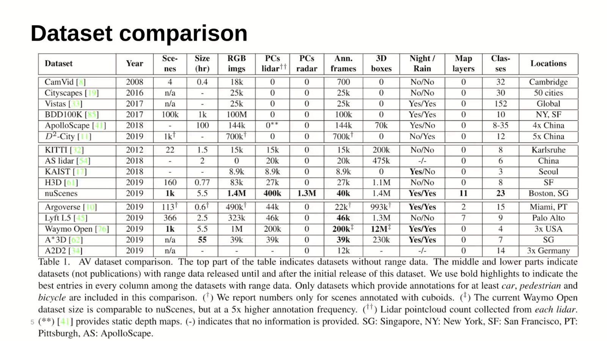

# Semantic-Segmentation-&-3D-Detection-using-Lidar-Point-Clouds
It's a repository which contains SOTA Algorithms list for semantic understanding of the environment using Lidar Point Clouds.

## Dataset for 3D Detection & Semantic Segmentation:
1. KITTI dataset for semantic segmentation

   a) Dataset: http://www.semantic-kitti.org/dataset.html#download
   
   b) Video: https://www.youtube.com/watch?v=3qNOXvkpK4I
   
2. RELLIS 3D dataset for semantic segmentation

   a) Dataset: https://unmannedlab.github.io/research/RELLIS-3D
   
   b) Video: https://www.youtube.com/watch?v=DzWc9qILLAw
   
3. KITTI dataset for 3D object detection: http://www.cvlibs.net/datasets/kitti/eval_object.php?obj_benchmark=3d

4. Waymo dataset for 3D object detection & Semantic Segmentation

   a) Dataset: https://waymo.com/open/download/
   
   b) Video: https://www.youtube.com/watch?v=tuhnwkUeMNo
   
5. NuScenes dataset for 3D object detection & Semantic Segmentation

   a) Dataset: https://www.nuscenes.org/download
   
   b) Video: https://www.youtube.com/watch?v=C6KbbndonGg

<p align="center">
    
</p>

## Competition Leader Board for Semantic Segmentation :
1. Waymo 3D Semantic Segmentation: https://waymo.com/open/challenges/3d-detection/
2. KITTI 3D Semantic Segmentation: http://www.semantic-kitti.org/tasks.html#semseg
3. NuScenes 3D Semantic Segmentation: https://www.nuscenes.org/lidar-segmentation?externalData=no&mapData=no&modalities=Lidar

## Competition Leader Board for 3D Detection :
1. Waymo 3D Object Detection: https://waymo.com/open/challenges/3d-detection/
2. KITTI 3D Object Detection: http://www.cvlibs.net/datasets/kitti/eval_object.php?obj_benchmark=3d
3. NuScenes 3D Object Detection: https://www.nuscenes.org/object-detection?externalData=all&mapData=all&modalities=Lidar

## Instructions during Labeling (Good Guideline to Read):
1. https://github.com/waymo-research/waymo-open-dataset/blob/master/docs/labeling_specifications.md

## Dataset Conversion Tool (For Labeling):
The dataset that we commonly face is a pointcloud topic inside a rosbag file. We can convert the pointcloud topic to a .pcd file and then to a .bin (kitti format) file for importing inside labeler tools during pointcloud labeling.
1. https://github.com/leofansq/Tools_RosBag2KITTI

We have to use the below repo to generate a 'poses.txt' file which is necessary during importing pointcloud inside 'pointlabeler'. 

2. https://github.com/jbehley/SuMa

We can also use ```1 0 0 0 0 1 0 0 0 0 1 0``` for each scan inside 'poses.txt' file if we couldn't generate the poses mentioned above. For example, if we have 3 scans (3 .bin file inside 'velodyne' folder) of a dataset, the 'poses.txt' file should look like this:
```
1 0 0 0 0 1 0 0 0 0 1 0
1 0 0 0 0 1 0 0 0 0 1 0
1 0 0 0 0 1 0 0 0 0 1 0
```

We also need a calibration file named 'calib.txt' which is necessary during importing pointcloud inside 'pointlabeler'. As a start, we can use:
```
P0: 1 0 0 0 0 1 0 0 0 0 1 0
P1: 1 0 0 0 0 1 0 0 0 0 1 0
P2: 1 0 0 0 0 1 0 0 0 0 1 0
P3: 1 0 0 0 0 1 0 0 0 0 1 0
Tr: 1 0 0 0 0 1 0 0 0 0 1 0
```

If one wants to do otherwise, I mean, wants to convert kitti dataset to rosbag format, he can find the way here.
1. https://github.com/tomas789/kitti2bag
2. https://github.com/ethz-asl/kitti_to_rosbag

## Good Repos/Videos to Look into regarding lidar perception:
1. https://github.com/LidarPerception
2. https://www.youtube.com/watch?v=zOaHuxMem5M
3. https://bobwang-robotics.medium.com/%E8%87%AA%E9%A7%95%E8%BB%8A%E9%96%8B%E6%94%BE%E6%95%B8%E6%93%9A%E5%BA%AB-ffe7a5975c96

## Dataset Labeling Tool:
1. https://github.com/jbehley/point_labeler
2. https://github.com/jbehley/voxelizer
3. https://github.com/bernwang/latte
4. https://github.com/unmannedlab/point_labeler
5. https://www.youtube.com/watch?v=kxtBvoitnbk

## State of the Art Approaches:
1. https://github.com/xinge008/Cylinder3D
2. https://github.com/mit-han-lab/e3d
3. https://github.com/PRBonn/lidar-bonnetal
4. https://github.com/charlesq34/pointnet
5. https://github.com/charlesq34/pointnet2
6. https://github.com/yanx27/Pointnet_Pointnet2_pytorch
7. https://github.com/qianguih/voxelnet
8. https://github.com/open-mmlab/OpenPCDet
9. https://github.com/AhmedARadwan/Super-Fast-Accurate-3D-Object-Detection
## ROS Implementation:
1. http://wiki.ros.org/semantic_point_annotator
2. https://github.com/LidarPerception/segmenters_lib
3. https://github.com/edward0im/voxelnet_ros
4. https://github.com/AbangLZU/VoxelNetRos
5. https://github.com/AhmedARadwan/Super-Fast-Accurate-3D-Object-Detection/tree/master/ros/src/super_fast_object_detection
6. https://github.com/YonoHub/waymo_ros
